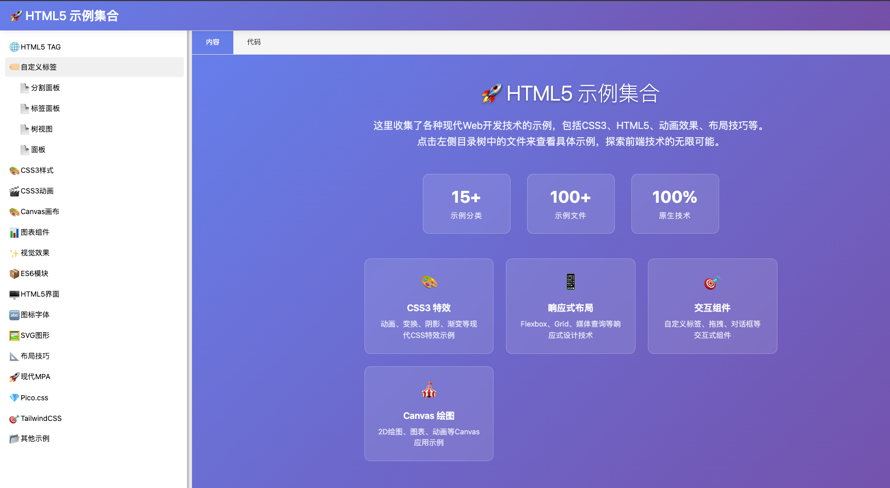

# Html5Samples

Html5 tag and css samples

- lastUpdate: 2025-08-20
- author: surfsky.github.io

## Features

- html5 ui
  - button
  - input
  - select
  - textarea
  - checkbox
  - radio
  - switch
  - slider
  - progress
  - toast
  - dialog
  - menu
  - tabs
  - accordion
  - carousel
  - grid
  - list
  - table
  - tree
  - menu
  - dialog
  - toast
  - progress
  - slider
  - switch
  - radio
  - checkbox
  - textarea
  - select
  - input
  - button
- css3
  - positon
  - layout
  - color
  - theme
  - animation
  - transform
  - transition
  - flexbox
  - grid
  - svg
  - iconfont
  - canvas
  - chart
- custom tag
- effect
- es6module
- css libs
  - picocss
  - tailwindcss
- misc
  - highlight
  - markdown
  - advertise

## RUN

Just run index.html in browser.

## TODO

## DONE

/检查一下index.html, index.js 动态变更iframe ur时未刷新，是什么原因？是tabPanel的问题，把iframe挪到外面就正常更新了。
/从index.html中剥离tree-view 自定义标签组件，放到 tagCustom/treeView 目录下。
spitplanel在index.html 中里面的百分比布局有问题，估计是splitpanel查找控件的问题，要约束父节点，而不是全页面。或者用shadow dom 方式容纳style，不污染全局。

